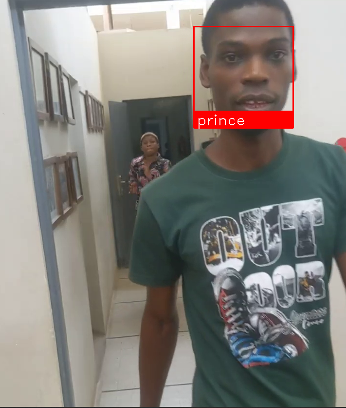

# pre-recorded-video-facial-recognition

This program recognizes faces in a pre-recorded video

## Installation

1. Clone the repository
2. Install the requirements

```bash
pip install -r requirements.txt
```

3. run the main file in the source directory

```bash
python main.py
```

## Usage

1. Place the video in the source directory
2. place the images of the people you want to recognize in the images directory
3. run the main file in the source directory

```bash
python main.py
```

## Screenshots



